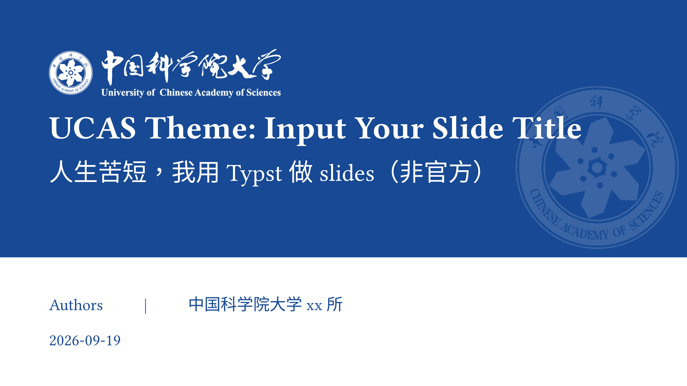

# ucas-slide

中国科学院大学（UCAS）演示文稿模板，基于 [Touying](https://github.com/touying-typ/touying) 构建。
当然，这是非官方的。
作者：汤磊

Presentation slides for the University of Chinese Academy of Sciences (UCAS), powered by Touying.

## 快速开始

```sh
typst init @preview/ucas-slide:0.1.0
cd ucas-slide
typst compile main.typ
```

或在已有文档中手动引入：

```typ
#import "@preview/ucas-slide:0.1.0": *

#show: ucas-theme.with(
  config-info(
    title: [报告标题],
    subtitle: [副标题],
    author: [作者],
    institution: [中国科学院大学],
    date: datetime.today(),
  ),
)

#title-slide()   // 封面
#outline-slide() // 目录

= 第一章          // 自动生成章节页
== 小节标题       // 内容页

#end-slide()     // 结束页（谢谢聆听）
```

## 嫌麻烦？
```
1. 直接down下来，用vscode打开
2. 下个"Tinymist"插件
3. 基于模板修改后，右击鼠标即可导出
```

## 可用的页面与组件

| 名称 | 用途 |
| --- | --- |
| `ucas-theme` | 主题入口，配合 `#show:` 使用 |
| `title-slide()` | 封面页（纯色标题条 + 半透明院徽水印） |
| `outline-slide()` | 目录页 |
| `end-slide(remark: [谢谢聆听])` | 结束页 |
| `article-title(..)` | 论文信息页（期刊 / 分区 / 影响因子 / 作者 / 机构） |
| `tblock` / `rblock` / `gblock` / `sblock` | 四种配色的小卡片（主题蓝 / 校徽红 / 金 / 银） |
| `lblock` | 细边框卡片 |
| `horz-block(..)` | 横向等分内容块（2～4 栏均可） |

一级标题（`= 章节`）会自动生成章节页，二级标题（`== 小节`）作为内容页标题。

## 依赖与要求

- Typst `0.13.0` 或更高版本
- [`@preview/touying:0.6.1`](https://typst.app/universe/package/touying)
- [`@preview/numbly:0.1.0`](https://typst.app/universe/package/numbly)

后两者由 Typst 自动下载，无需手动安装。

## 自定义

- **主色 / 配色**：编辑 `ucas-slide.typ` 顶部的 `ucas-blue` 等颜色变量，或在
  `ucas-theme` 的 `config-colors(...)` 中覆盖 `primary`。
- **字体**：在文档里用 `#set text(font: (...))` 指定中英文字体。
- **封面的院徽水印浓淡**：修改 `ucas_fig/中国科学院院徽（白色）-水印.png` 的 alpha 通道。

## 许可证

本模板的代码以 **MIT** 许可发布，详见 [LICENSE](LICENSE)。

**例外**：`ucas_fig/` 目录下的中国科学院院徽、中国科学院大学校徽/标准字等标识
（`中国科学院院徽*.png`、`中国科学院院徽（白色）-半透明.svg`、`国科大标准Logo*.png`）
**不在 MIT 许可范围内**，其版权归中国科学院 / 中国科学院大学所有。
使用这些标识请遵守校方/院方的视觉识别与标识使用规范。
如果你是模板使用者而非校方授权发布者，请自行确认所在单位的相关规定。

## License

The template code is licensed under **MIT** (see [LICENSE](LICENSE)).

The institutional logos in `ucas_fig/` are **not** covered by the MIT license; they are
the property of the Chinese Academy of Sciences / University of Chinese Academy of
Sciences and are included only for use by their members in accordance with the
institution's brand guidelines.
