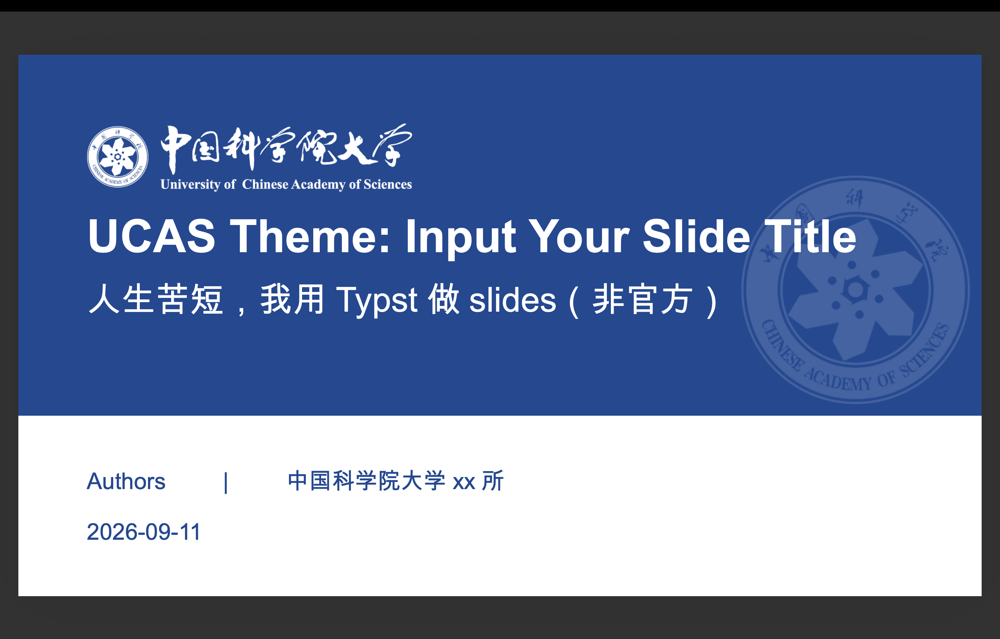

# ucas-slide



中国科学院大学（UCAS）演示文稿与作业纸模板，基于 [Touying](https://github.com/touying-typ/touying) 构建。
当然，这是非官方的。
作者：汤磊

Presentation slides and homework sheets for the University of Chinese Academy of Sciences (UCAS), powered by Touying.

## 安装

Typst 没有 Cargo 那样写进清单的 git 依赖语法：`typst.toml` 里不能声明依赖，也不支持
`#import "https://..."`。但 Typst 的相对路径导入已经足够——**把仓库放进你的项目**
即可，无需发布到 Universe，也不需要安装任何东西。

### 方式一：作为 git 子模块（推荐）

和 Rust 用 git 依赖一样的思路：依赖放进项目目录，由 git 锁定提交，
不改动你机器上的任何全局配置。

```sh
cd 你的项目
mkdir -p vendor
git submodule add https://github.com/CodeWenjiu/ucas-slide vendor/ucas-slide
```

然后在文档里用相对路径导入：

```typ
#import "vendor/ucas-slide/lib.typ": *
```

作业纸同理（符号在 `hw` 命名空间下）：

```typ
#import "vendor/ucas-slide/lib.typ": hw

#show: hw.ucas-hw-theme.with(course: [课程], name: [姓名], student-id: [学号])
#hw.hw-title([作业一])
```

克隆带子模块的项目时用 `git clone --recurse-submodules`，或事后执行
`git submodule update --init`。升级模板就切子模块里的提交，
改动会被 `git status` 如实反映，跟普通依赖一样可审计。

### 方式二：直接拷贝

不想用子模块，把仓库下下来拷进项目也可以，导入路径写法完全一样：

```sh
git clone https://github.com/CodeWenjiu/ucas-slide /tmp/ucas-slide
cp -r /tmp/ucas-slide 你的项目/vendor/ucas-slide
```

包内素材（`ucas_fig/`）全部用相对路径引用，所以只要整份目录完整，
放在哪里、叫什么名字都能正常工作。

### 方式三：Typst Universe（发布后可用）

也可以等它发布到 Universe，由 Typst 自动下载：

```sh
typst init @preview/ucas-slide:0.1.0
cd ucas-slide
# Typst 在首次导入时自动下载包，无需手动安装
typst compile main.typ
```

### 在已有文档中使用

不管用哪种方式拿到模板，演示文稿主题的用法都一样（下面以子模块路径为例，
用 Universe 的话把 `vendor/ucas-slide/lib.typ` 换成 `@preview/ucas-slide:0.1.0`）：

```typ
#import "vendor/ucas-slide/lib.typ": *

#show: ucas-theme.with(
  config-info(
    title: [报告标题],
    subtitle: [副标题],
    author: [作者],
    institution: [中国科学院大学],
    date: datetime.today(),
  ),
)

#title-slide()   // 封面
#outline-slide() // 目录

= 第一章          // 自动生成章节页
== 小节标题       // 内容页

#end-slide()     // 结束页（谢谢聆听）
```

作业纸主题的符号放在 `hw` 命名空间下（两个主题存在同名常量，必须隔开）：

```typ
#import "vendor/ucas-slide/lib.typ": hw

#show: hw.ucas-hw-theme.with(
  course: [机器学习基础],
  name: [张三],
  student-id: [2024E8012345678],
)

#hw.hw-title([第一次作业：线性回归与梯度下降])
= 习题一

#hw.hw-problem(number: [第 1 题], title: [正规方程])[
  题目内容……
]
```

## 嫌麻烦？

```
1. 直接down下来，用vscode打开
2. 下个"Tinymist"插件
3. 基于模板修改后，右击鼠标即可导出
```

## 开发本仓库

仓库自带 Nix flake，进入目录即可获得锁定版本的 Typst：

```sh
nix develop          # 或装好 nix-direnv 后直接 cd 进来
typst compile main.typ
```

devShell 会在**本环境内**把仓库挂成 `@preview/ucas-slide:<版本>` 的本地副本
（写到仓库自己的 `.typst-packages/`，不碰你的全局目录），因此 `template/` 与
`main.typ` 里写死的 `@preview/...` 导入在发布前也能编译验证。
发布到 Universe 之后，同一份文件无需修改即可正常工作。

如果不用 Nix，直接 `typst compile main.typ` 会因找不到该包而报错，
这是预期的（仓库内示例刻意使用与终端用户一致的导入写法）；
把 `main.typ` 的导入改为相对路径 `./ucas-slide.typ` 即可绕开。

## 可用的页面与组件

| 名称 | 用途 |
| --- | --- |
| `ucas-theme` | 主题入口，配合 `#show:` 使用 |
| `title-slide()` | 封面页（纯色标题条 + 半透明院徽水印） |
| `outline-slide()` | 目录页 |
| `end-slide(remark: [谢谢聆听])` | 结束页 |
| `article-title(..)` | 论文信息页（期刊 / 分区 / 影响因子 / 作者 / 机构） |
| `tblock` / `rblock` / `gblock` / `sblock` | 四种配色的小卡片（主题蓝 / 校徽红 / 金 / 银） |
| `lblock` | 细边框卡片 |
| `horz-block(..)` | 横向等分内容块（2～4 栏均可） |

一级标题（`= 章节`）会自动生成章节页，二级标题（`== 小节`）作为内容页标题。

作业纸主题（`hw` 命名空间）提供：

| 名称 | 用途 |
| --- | --- |
| `hw.ucas-hw-theme` | 作业纸主题入口（A4，页眉页脚 + 院徽水印） |
| `hw.hw-title(..)` | 标题区，下方自带学号 / 姓名 / 课程填写栏 |
| `hw.hw-problem(..)` | 题目 |
| `hw.hw-note(..)` | 提示 / 要求框 |
| `hw.hw-info(..)` | 单独渲染学号姓名填写栏 |

## 依赖与要求

- Typst `0.13.0` 或更高版本（在 0.15.1 上测试通过）
- [`@preview/touying:0.6.1`](https://typst.app/universe/package/touying)
- [`@preview/numbly:0.1.0`](https://typst.app/universe/package/numbly)

后两者由 Typst 自动下载，无需手动安装。

## 自定义

- **主色 / 配色**：编辑 `ucas-slide.typ` 顶部的 `ucas-blue` 等颜色变量，或在
  `ucas-theme` 的 `config-colors(...)` 中覆盖 `primary`。
- **字体**：在文档里用 `#set text(font: (...))` 指定中英文字体。模板默认不指定字体，
  交给 Typst 的内置字体与系统字体回退，以免因缺少某个字体而产生警告。
- **封面的院徽水印浓淡**：修改 `ucas_fig/中国科学院院徽（白色）-水印.png` 的 alpha 通道，
  或把 `ucas-badge-watermark` 指向你自己的图片。

## 许可证

本项目的代码以 **MIT** 许可发布，详见 [LICENSE](LICENSE)。

**例外**：`ucas_fig/` 目录下的中国科学院院徽、中国科学院大学校徽/标准字等标识
**不在 MIT 许可范围内**，其版权归中国科学院 / 中国科学院大学所有。
使用这些标识请遵守校方/院方的视觉识别与标识使用规范。
如果你是模板使用者而非校方授权发布者，请自行确认所在单位的相关规定。
详见 [LOGO_COPYRIGHT.md](LOGO_COPYRIGHT.md)。

## License

The template code is licensed under **MIT** (see [LICENSE](LICENSE)).

The institutional logos in `ucas_fig/` are **not** covered by the MIT license;
they are the property of the Chinese Academy of Sciences / University of Chinese
Academy of Sciences and are included only for use by their members in accordance
with the institution's brand guidelines. See [LOGO_COPYRIGHT.md](LOGO_COPYRIGHT.md).